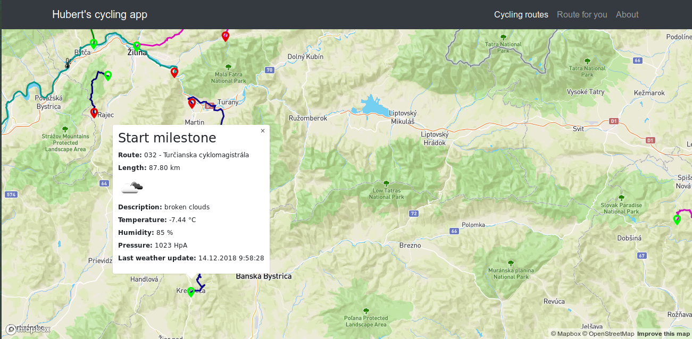
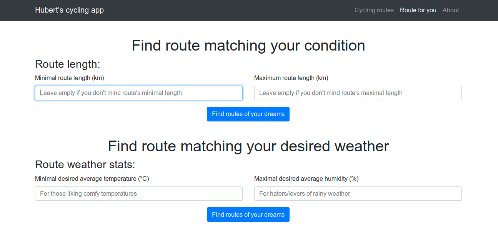

# Overview

Application works with cycling routes data on the map and it's most important features are:
- show cycling routes and their data - name and length
- show their weather data - 1 route has more weather points based on it's length
- filtering cycling routes by desired minimal temperature and maximal humidity
- filtering cycling routes by their length

This is it in action:






The application has 2 separate parts, the client which is a [frontend web application](#frontend) using mapbox API and mapbox.js and the [backend application](#backend) written in [Node.js](https://nodejs.org/en/), backed by PostGIS. The frontend application communicates with backend using an [API](#api). API is documented in interactive form with Swagger tool.

# Frontend

The frontend application consists of two HTML pages: (`index.html`) and (`filter.html`). Both of the HTML files are displaying showing cycling routes geodata on the map via JS Mapbox library. 

*Filter page* contains formular with selecting user's preferencies on routes and after submitting calls Backend's API with selected parameters. API will return routes that fit into user's preferences. All dynamic JavaScript actions are done via JQuery library - mainly validating form inputs, sending API request via AJAX and initializing map with obtained cycling routes. 

*Index page* contains a map with all cycling routes and their corresponding weather data.

*Map initialization scripts* are stored in (`js/map.js`) file. *Filtering validations and API calls* are stored in (`js/filter.js`) file. *Script file for index file* is stored in (`js/main.js`).

*Route colors* are generated randomly via a Color generator script.

*Weather icons* are obtained from *OpenWeatherMap repository*.

# Backend

The backend application powered by Node.js and is responsible for:
- importing cycling routes data into POSTGIS database from gpx format
- continually gathering weather data relevant to saved routes data
- serving static files
- serving API
- communication with Postgres database
- serving API documentation
- logging application events into log files

## Data

Hotel data is coming directly from Open Street Maps. I downloaded an extent covering whole Slovakia (around 1.2GB) and imported it using the `osm2pgsql` tool into the standard OSM schema in WGS 84 with hstore enabled. To speedup the queries I created an index on geometry column (`way`) in all tables. The application follows standard Rails conventions and all queries are placed in models inside `app/models`, mostly in `app/models/hotel.rb`. GeoJSON is generated by using a standard `st_asgeojson` function, however some postprocessing is necessary (in `app/controllers/search_controller.rb`) in order to merge all hotels into a single geojson.

## Api

**Find hotels in proximity to coordinates**

`GET /search?lat=25346&long=46346123`

**Find hotels by name, sorted by proximity and quality**

`GET /search?name=hviezda&lat=25346&long=46346123`

### Response

API calls return json responses with 2 top-level keys, `hotels` and `geojson`. `hotels` contains an array of hotel data for the sidebar, one entry per matched hotel. Hotel attributes are (mostly self-evident):
```
{
  "name": "Modra hviezda",
  "style": "modern", # cuisine style
  "stars": 3,
  "address": "Panska 31"
  "image_url": "/assets/hotels/652.png"
}
```
`geojson` contains a geojson with locations of all matched hotels and style definitions.
